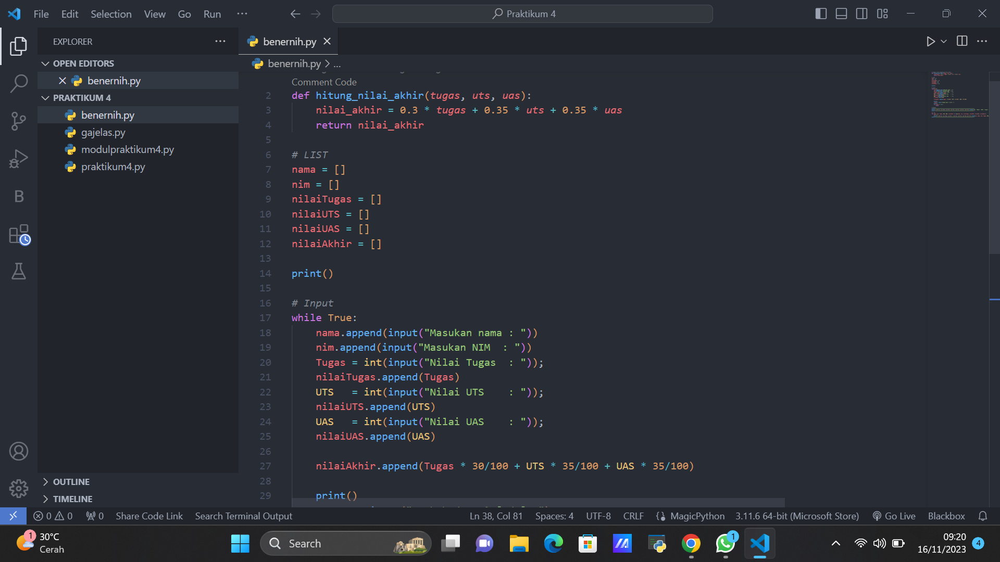
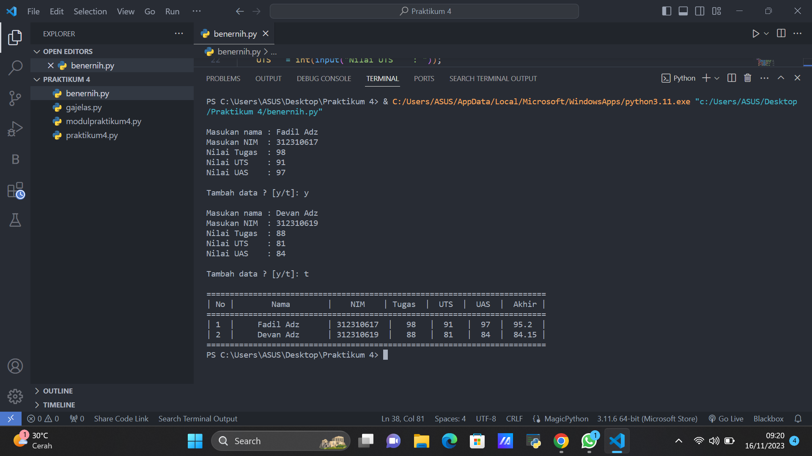

# Pertemuan 9
## Praktikum 4

## Profil
| Variable | Isi |
| -------- | --- |
| **Nama** | Fadil Aditya Adzima |
| **NIM** |  312310617 |
| **Kelas** | TI.23.A.6 |
| **Mata Kuliah** | Bahasa Pemrograman |

## Tugas Modul Praktikum 4 
Buat program sederhana untuk menambahkan data kedalam sebuah list dengan rincian sebagai berikut:
- Progam meminta memasukkan data sebanyak-banyaknya (gunakan perulangan)
- Tampilkan pertanyaan untuk menambah data (y/t?), apabila jawaban t (Tidak), maka program akan menampilkan daftar datanya. 
- Nilai Akhir diambil dari perhitungan 3 komponen nilai (tugas: 30%, uts: 35%, uas: 35%)

### Flowchart dari soal berikut : 

### Program dari soal berikut : 

1. Membuat terlebih dahulu list kosong untuk nantinya dimasukkan data list dari nama, NIM, tugas, uts dan uas.
2. Menggunakan perulangan while True yang artinya perulangan terus menerus.
3. Membuat data untuk input nama, NIM, tugas, uts, uas, dan nilai akhir. gunakan tipe data integer pada tugas, uts, dan uas karena data yang dimasukkan berupa angka. dan pada nilai akhir untuk menghitung total dari perhitungan tugas x 30%, uts x 35%, dan uas x 35%.
4. Buat list untuk memasukkan semua data yang sudah diinput.
5. Tambahkan list yang baru saja dibuat untuk dimasukkan kedalam list yang pertama kali di buat.
6. Lalu menggunakan fungsi continue jika TambahData = y dan break jika TambahData = t.
7. Gunakan perulangan for di dalam while True. perulangan dimaksudkan agar data bisa dimasukkan berkali kali.
8. enumerate pada for berfungsi untuk menambahkan index atau penomoran pada setiap data list yang di print. 'nomor' untuk index penomoran dan 'mahasiswa' untuk pengambilan data dari list_mahasiswa. 
9. lalu print sesuai dengan nomor urutan pada list_mahasiswa.
10. dan perulangan akan selesai jika TambahData = t.

### Maka output dari program tersebut : 

